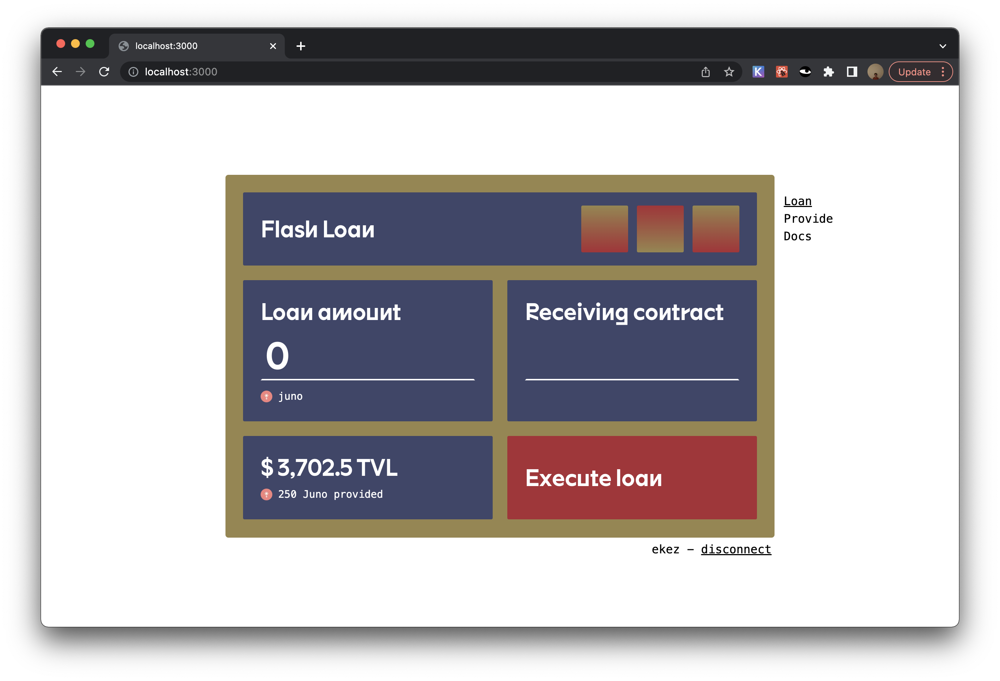
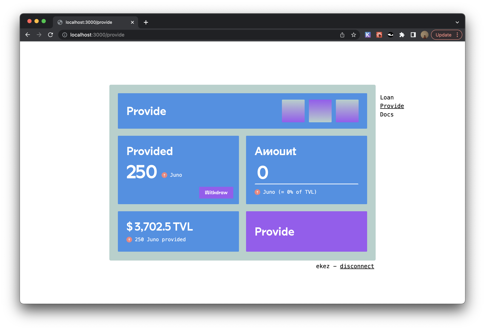

# CosmWasm Flash Loan UI

[cw-flash-ui.vercel.app](https://cw-flash-ui.vercel.app/)

This is a frontend for executing and providing funds for flash
loans. It is built around a CosmWasm smart contract current deployed
on the Juno testnet.

## Deploy your own

Deploy the example using
[Vercel](https://vercel.com?utm_source=github&utm_medium=readme&utm_campaign=next-example).

You will also neeed to deploy a flash loan contract. The contract this
UI expects to interact with can be found
[here](https://github.com/ezekiiel/cw-flash-loan). Two important
things to note:

1. The flash loan contract has not been audited. Please, please,
   please do not put large sums of money into it or use it for
   anything mission critical.
2. The flash loan contract and this contract are licensed under the
   AGPL. Please be sure to distribute the source code for the contract
   along with any frontend you deploy using it. 

## How to use

1. Deploy the CosmWasm flash loan contract (not open source yet).
2. Configure environment variables in `.env`.
3. Run `yarn && yarn dev` in the git repository.
